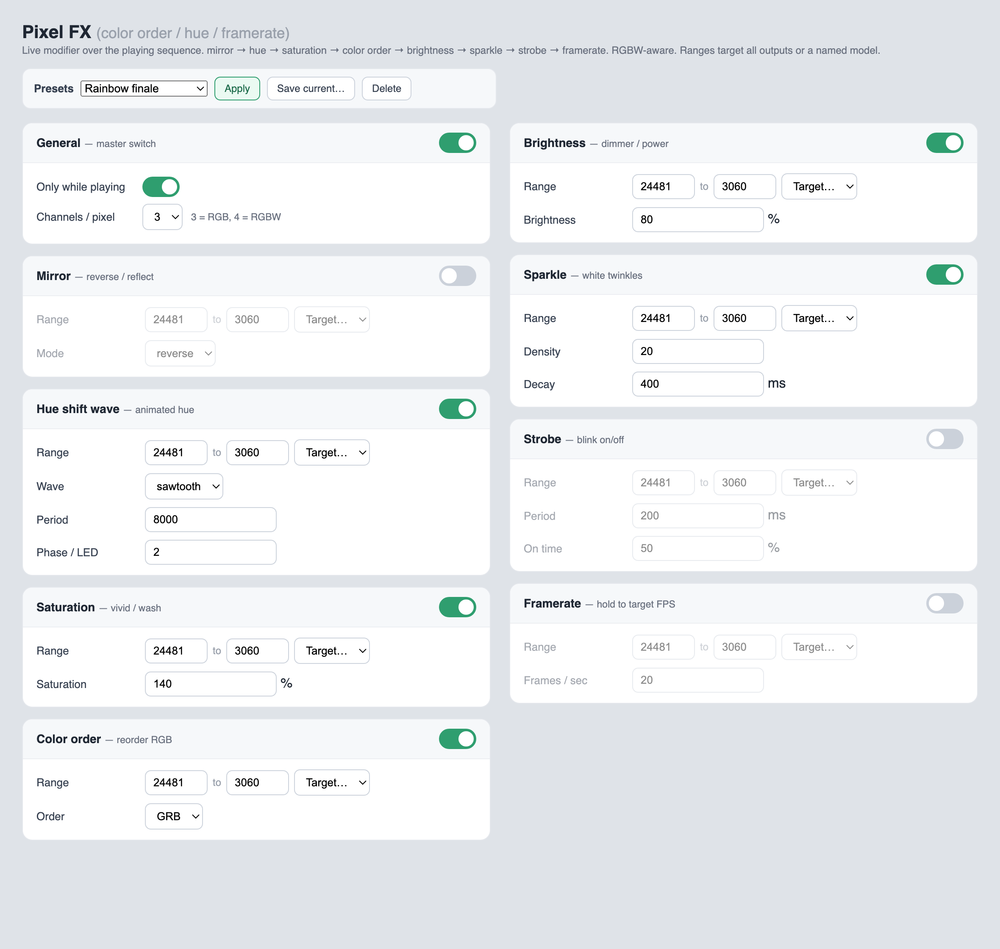

# pixelfx — FPP plugin

A single FPP **ChannelData** plugin that layers several independently-toggleable
modifier functions over the playing sequence, applied each frame just before
output, in this fixed order:

1. **Mirror** — reverse or reflect the pixels in a range.
2. **Hue shift** — animated hue rotation (sine/triangle/sawtooth/square) with an
   optional per-pixel phase for a traveling rainbow wave. Uses a
   luminance-preserving rotation matrix (cos/sin LUT), so it scales to large
   ranges even on a single-core BeagleBone.
3. **Saturation** — boost or wash out color (0 = grayscale … >100% = vivid).
4. **Color order** — reorder the R/G/B bytes of each pixel (RGB…BGR).
5. **Brightness** — dimmer / power limiter.
6. **Sparkle** — random white twinkles with adjustable density and decay.
7. **Strobe** — blink on/off at a chosen rate and duty.
8. **Framerate** — hold frames to a target FPS for a choppy / low-FPS look.

Each function has its own enable and channel range, under one master switch.
**RGBW-aware** (`channelsPerPixel` 3 or 4 — the white channel is preserved by
hue and color-order). Ranges default to all configured output channels.

**Presets** — save/recall named configurations from the settings page (stored in
the `presets` setting), and apply them at show time via the FPP command below.

**FPP commands** (so playlists / scheduler / MQTT / effects can drive it):
`Pixel FX - Master`, `Pixel FX - Function On/Off`, `Pixel FX - Set Value`,
`Pixel FX - Apply Preset`. Defined in `commands/descriptions.json`; each posts to
the plugin's settings API so changes apply live.

## Settings page

The plugin adds a settings page under **Content Setup → Pixel FX**. Each function
is a card with its own enable toggle and channel range; the range auto-fills to
all configured output channels (the **All outputs** button re-detects from your
FPP output config). Left: out of the box. Right: configured.



## FPP compatibility (5.4 → 9.x)

One source compiles against any FPP from **5.4 onward** — it uses only plugin API
present in every version (the `FPPPlugin(name)` ctor, `modifyChannelData`, the
`settings` map + `reloadSettings()`, and the test/sequence state) and avoids the
9.x-only `settingChanged`/FileMonitor hooks. The plugin is compiled on each
device against that device's headers, so version-specific details resolve
automatically. Built with `-std=gnu++2a` (works on Debian 10 / GCC 8 through
current GCC).

Because 5.4 has no live settings callback, the plugin **re-reads its settings
file about twice a second**, so app/UI changes apply within ~0.5 s with no fppd
restart on every supported version.

## Modifier-layer behavior

- Acts on the live channel buffer — the `.fseq` on disk is never changed.
- **Test patterns are never modified.**
- **`onlyWhenPlaying` (default on):** only modifies while a sequence is playing.
  Turn off to also affect bridged E1.31/DDP input and idle output.

## Build

```bash
make                      # -> libpixelfx.so (or .dylib on macOS)
make FPPDIR=/path/to/fpp  # if FPP is not at /opt/fpp
```

`scripts/fpp_install.sh` runs the build on install. `callbacks.sh` tells FPP to
load the compiled library. **Restart fppd** to load it.

## Settings (`<config>/plugin.pixelfx`)

The full, authoritative list of keys (with types, ranges, defaults and grouping)
is the `settingsSchema` array in [`pluginInfo.json`](pluginInfo.json) — the app
and settings page render from it. Summary:

| Group | Keys | Meaning |
|---|---|---|
| general | `enabled`, `onlyWhenPlaying`, `channelsPerPixel` (3/4) | Master switch, playback gate, RGB/RGBW |
| mirror | `mr_enabled`, `mr_startChannel`, `mr_channelCount`, `mr_mode` (reverse/mirror) | Reverse/reflect pixels |
| hueshift | `hs_enabled`, range, `hs_hueWave`, `hs_huePeriodMs`, `hs_hueDepthDeg`, `hs_huePhasePerChannel` | Animated hue |
| saturation | `sa_enabled`, range, `sa_level` (%) | Boost/wash color |
| colororder | `co_enabled`, range, `co_colorOrder` | Reorder R/G/B |
| brightness | `br_enabled`, range, `br_level` (%) | Dimmer / power limit |
| sparkle | `sp_enabled`, range, `sp_density`, `sp_decayMs` | White twinkles |
| strobe | `st_enabled`, range, `st_periodMs`, `st_duty` (%) | Blink on/off |
| framerate | `fr_enabled`, range, `fr_fps` | Hold frames |

Every function has its own `*_startChannel` / `*_channelCount` (channels;
1 RGB LED = 3 channels), which default to all configured output channels. The
`presets` key holds a JSON map of saved presets (managed by the settings page).

## Install / control

- Install: see [`../INSTALL.md`](../INSTALL.md) (manual) or
  [`../DISTRIBUTE.md`](../DISTRIBUTE.md) (GitHub → FPP UI).
- App control over REST: see [`../APP_API.md`](../APP_API.md). All keys above are
  in `pluginInfo.json`'s `settingsSchema`, grouped by function, so an app can
  auto-render the three sections.
